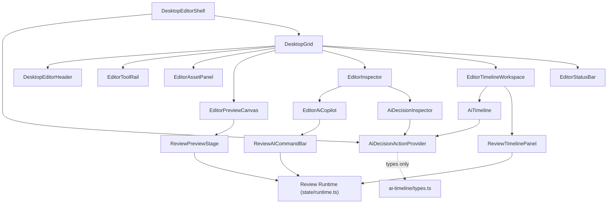
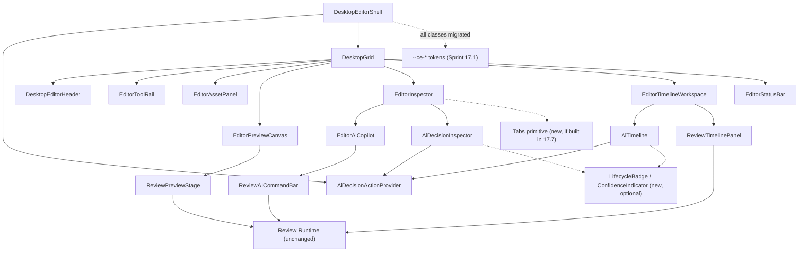
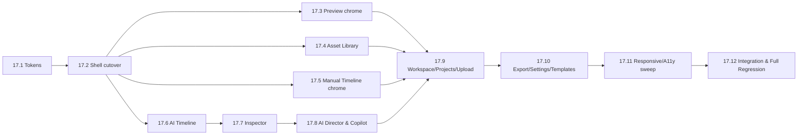
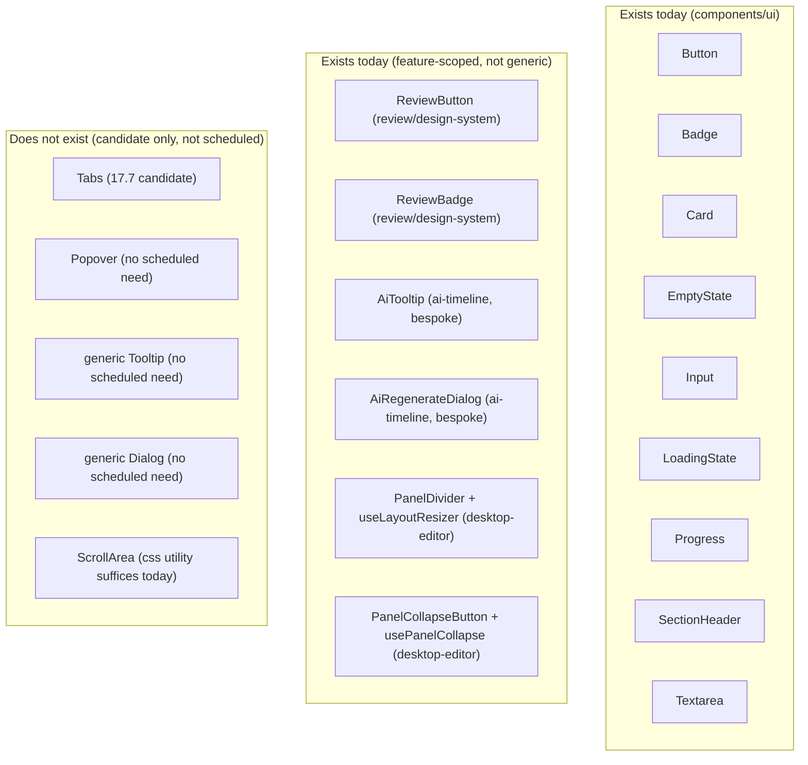
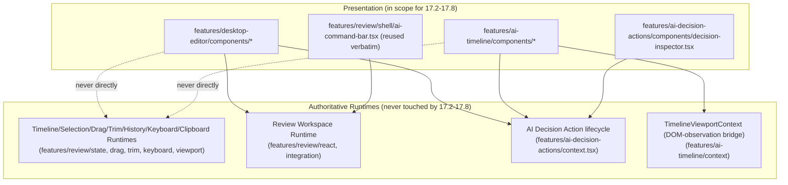

# Component Migration Map

Sprint 17.1.5 — Desktop UX Blueprint (completion task)
Date: 2026-07-29
Status: Documentation only. No UI redesigned, no runtime modified, Sprint 17.2 has not begun.

This document is the migration contract for the entire EPIC 17 frontend redesign (Sprints 17.2–17.12). It tells every future sprint which component is being replaced, which is preserved, who owns runtime vs. presentation, when old code can be deleted, and how regressions are avoided.

## Methodology note (read first)

This document was built by directly reading `frontend/src/app/`, `frontend/src/components/`, `frontend/src/features/desktop-editor/`, `frontend/src/features/ai-timeline/`, `frontend/src/features/ai-decision-actions/`, `frontend/src/features/review/`, `frontend/src/features/playback/`, and `frontend/src/lib/` — not inferred or invented. Every required section below (Desktop Editor Shell, Preview Workspace, Asset Library, Manual Timeline, AI Timeline, Inspector, AI Director, Shared Components) lists the example component names as requested. For each:

- If a component with that exact name or an equivalent (differently-named but same-purpose) exists, it is listed with its **real exported name and real file path**.
- If no such component exists — because the responsibility is inlined directly inside a larger component rather than extracted — it is explicitly marked **"Not extracted — inline in `<real component>`"**. This is itself a migration-relevant fact: extracting that responsibility into its own component (if a future sprint wants to) is new work, not a rename.

No fictitious file paths or component names appear anywhere in this document.

---

## 1. Desktop Editor Shell

| Current Component | Current File | Runtime Owner | UI Owner | Sprint | Migration Strategy | Compatibility | Delete Old? | Notes |
|---|---|---|---|---|---|---|---|---|
| `DesktopEditorShell` | `features/desktop-editor/components/desktop-editor-shell.tsx` | `DesktopEditorRuntimeAdapter` (via `ReviewWorkspaceProvider`) | Desktop Editor | 17.2 | Refactor | Fully Compatible | No | **Migrated in 17.2.** Root wrapper cut to `--ce-bg-workspace`/`--ce-text-primary`; now composes the new `EditorAiDirectorDock` reserved region; structure otherwise unchanged. |
| `DesktopGrid` | `features/desktop-editor/components/desktop-grid.tsx` | None (pure layout) | Desktop Editor | 17.2 | Preserve | Fully Compatible | No | **Migrated in 17.2.** Added a new `aiDirector` grid row (reserved dock) and `data-editor-focus-zone` attributes on the assets/preview/timeline/inspector wrapper divs (blueprint focus zones), all at the shell-composition level — no change to the panels' own internal content. |
| `DesktopEditorHeader` (requested: EditorHeader) | `features/desktop-editor/components/desktop-editor-header.tsx` | Review Runtime (dirty/save state passed as props) | Desktop Editor | 17.2 | Refactor | Fully Compatible | No | **Migrated in 17.2.** Cut directly onto `--ce-*` (bypassing the `--desktop-editor-*` alias layer); `role="banner"`, `data-editor-focus-zone="header"`, `.ce-focus-ring` added to every interactive control. |
| `EditorStatusBar` (requested: StatusBar) | `features/desktop-editor/components/editor-status-bar.tsx` | None (display-only) | Desktop Editor | 17.2 | Refactor | Fully Compatible | No | **Migrated in 17.2.** Cut to `--ce-*`; **honesty fix** — Zoom/Snap/Resolution/Speed previously rendered hardcoded fake values ("100%"/"On"/"1080×1920"/"1x") with no runtime source; now render "Pending Runtime" when unset, matching the AI Decision Actions pattern. FPS/Cursor/Duration remain real (wired from `view?.timeline`). |
| `EditorToolRail` (requested: ToolRail) | `features/desktop-editor/components/editor-tool-rail.tsx` | None (local tab state) | Desktop Editor | 17.2 | Refactor | Fully Compatible | No | **Migrated in 17.2.** Cut to `--ce-*`; `.ce-scroll` applied; `data-editor-focus-zone="tool-rail"`. |
| — (requested: PanelLayout) | *Not extracted — role served by `DesktopGrid`* | — | — | — | — | — | — | No separate `PanelLayout` component exists; do not create one unless a real need to decouple grid-area definition from `DesktopGrid` emerges. |
| `PanelDivider` (requested: PanelResizeHandle) | `features/desktop-editor/components/panel-divider.tsx` | `useLayoutResizer` (`layout-resizer.tsx`) | Desktop Editor | 17.2 | Preserve | Fully Compatible | No | **Migrated in 17.2.** Token pass only (`--ce-border-default`/`--ce-accent-primary`/`--ce-accent-soft`) plus `.ce-focus-ring`; drag/keyboard/reset logic byte-identical. |
| `PanelCollapseButton` (requested: PanelCollapseController) | `features/desktop-editor/components/panel-collapse-button.tsx` | `usePanelCollapse` (`hooks/use-panel-collapse.ts`) | Desktop Editor | 17.2 | Preserve | Fully Compatible | No | **Migrated in 17.2.** Token pass only; `usePanelCollapse` itself remains unused/unwired (pre-existing, not addressed this sprint). |
| `useDesktopEditorLayout` | `features/desktop-editor/hooks/use-desktop-editor-layout.ts` | Desktop Editor (UI state) | Desktop Editor | 17.2 | Refactor | Fully Compatible | No | **Migrated in 17.2.** Added `computeResponsiveDesktopEditorLayout` — a pure function applying the blueprint's collapse-priority order (compact rail → narrow Asset → collapse Asset → narrow Inspector → collapse Inspector) whenever the live viewport width would otherwise push Preview below its protected minimum (480px). Runtime-local only; no persistence added. |
| `DesktopEditorRuntimeAdapter` | `features/desktop-editor/runtime-adapter.tsx` | Review Runtime (bridges `ReviewWorkspaceProvider`) | — (bridge only) | N/A | Preserve | Fully Compatible | No | The one file in this feature that touches the authoritative runtime — never in scope for any 17.2–17.8 visual sprint. Untouched in 17.2. |
| `EditorAiDirectorDock` (new) | `features/desktop-editor/components/editor-ai-director-dock.tsx` | None (static placeholder) | Desktop Editor | 17.2 (reserved) / 17.8 (real UI) | Split | Fully Compatible | No | **New in 17.2.** Reserves the AI Director's docked-strip grid location per the blueprint's canonical layout. Renders no input and calls nothing — the real `ReviewAICommandBar` submission boundary stays inside `EditorAiCopilot`, untouched, until 17.8 decides how/whether to relocate it. |

## 2. Preview Workspace

| Current Component | Current File | Runtime Owner | UI Owner | Sprint | Migration Strategy | Compatibility | Delete Old? | Notes |
|---|---|---|---|---|---|---|---|---|
| `EditorPreviewCanvas` (requested: PreviewSurface) | `features/desktop-editor/components/editor-preview-canvas.tsx` | Review Runtime (via props) | Desktop Editor | 17.3 | Refactor | Fully Compatible | No | Layout wrapper only; error branch is this file's own state, not a separate component. |
| `ReviewPreviewStage` | `features/review/shell/workspace-panels.tsx` | Review Runtime | Review (shared, authoritative) | N/A | Preserve | Fully Compatible | No | The real preview surface `EditorPreviewCanvas` wraps. Never touched by 17.3 — idle-dim is implemented as a sibling overlay in `EditorPreviewCanvas`, per `desktop-editor-ux-blueprint.md` P10/17.3 scope. |
| — (requested: PlaybackControls) | *Not extracted — inline in `ReviewPreviewStage`* | Review Runtime | Review | — | — | — | — | Play/volume/time-label controls are inlined JSX inside `ReviewPreviewStage`, not a separate component. Extracting them is out of scope for 17.3 (would touch `review/shell`). |
| — (requested: TransportBar) | *Does not exist anywhere in `src/`* | — | — | — | — | — | — | No equivalent under any name. |
| — (requested: ZoomControls) | *Not extracted — inline in `ReviewTimelinePanel`, not Preview* | Review Runtime | Review | — | — | — | — | Zoom controls belong to the Timeline, not Preview — the requested category placement doesn't match real ownership; flagged so no sprint mistakenly looks for zoom controls inside the Preview surface. |
| — (requested: Canvas) | *Does not exist as a standalone component* | — | — | — | — | — | — | The `<video>` element lives directly inside `ReviewPreviewStage`. |
| — (requested: SafeArea) | *Does not exist anywhere in `src/`* | — | — | — | — | — | — | No safe-area guide concept implemented today; would be a new feature, not a migration. |
| — (requested: PosterState) | *Not extracted — `poster` attribute on `ReviewPreviewStage`'s `<video>`* | Review Runtime | Review | — | — | — | — | Sourced from `view.thumbnailUrl`; no separate component. |
| — (requested: LoadingOverlay) | *Served by `ReviewWorkspaceLoadingState`* | Review Runtime | Review | N/A | Preserve | Fully Compatible | No | `features/review/integration/runtime-states.tsx` — full-viewport loading screen, not an in-canvas overlay. `components/ui/loading-state.tsx`'s `LoadingState` is a separate, generic full-panel primitive (see §8). |
| — (requested: ErrorOverlay) | *Served by `EditorPreviewCanvas`'s own `runtimeError` branch + `ReviewWorkspaceErrorState`* | Review Runtime | Desktop Editor / Review | 17.3 | Refactor | Fully Compatible | No | Two separate real mechanisms: the Desktop Editor's own in-canvas error branch, and Review's full-viewport `ReviewWorkspaceErrorState` (`runtime-states.tsx`). Neither is named `ErrorOverlay`; do not merge them without an explicit decision, since one is scoped to Editor-adapter failures and the other to Review Runtime failures. |

## 3. Asset Library

| Current Component | Current File | Runtime Owner | UI Owner | Sprint | Migration Strategy | Compatibility | Delete Old? | Notes |
|---|---|---|---|---|---|---|---|---|
| `EditorAssetPanel` (requested: AssetPanel) | `features/desktop-editor/components/editor-asset-panel.tsx` | None (mock data only, `MOCK_ASSETS`) | Desktop Editor | 17.4 | Refactor | Fully Compatible | No | No asset runtime/API exists yet — explicit constraint carried from 16.10.6.1 that this remains mock-backed through 17.4. |
| — (requested: AssetCard) | *Not extracted — inline `<button>` in `.map()`* | — | Desktop Editor | 17.4 (optional) | Split | Fully Compatible | No | Extracting into a real `AssetCard` is an available option in 17.4 (adds a Shared Component), not required. |
| — (requested: AssetGrid) | *Not extracted — conditional `className` in `EditorAssetPanel`* | — | Desktop Editor | 17.4 (optional) | Split | Fully Compatible | No | Grid/list toggle is inline conditional classes, not a component. |
| — (requested: AssetList) | *Not extracted — same conditional as AssetGrid* | — | Desktop Editor | 17.4 (optional) | Split | Fully Compatible | No | See AssetGrid row. |
| — (requested: AssetToolbar) | *Does not exist anywhere in `src/`* | — | — | — | — | — | — | No equivalent under any name. |
| — (requested: AssetSearch) | *Not extracted — inline `<input>` in `EditorAssetPanel`* | — | Desktop Editor | 17.4 (optional) | Split | Fully Compatible | No | — |
| — (requested: AssetFilters) | *Not extracted — inline collection-tab buttons in `EditorAssetPanel`* | — | Desktop Editor | 17.4 (optional) | Split | Fully Compatible | No | "Local/AI Assets/Stock/Photos/…" tabs. |

## 4. Manual Timeline

| Current Component | Current File | Runtime Owner | UI Owner | Sprint | Migration Strategy | Compatibility | Delete Old? | Notes |
|---|---|---|---|---|---|---|---|---|
| `ReviewTimelinePanel` (requested: TimelineContainer) | `features/review/shell/timeline.tsx` | **Timeline/Selection/Drag/Trim/History/Keyboard/Clipboard Runtimes** (authoritative) | Review (shared, authoritative) | 17.5 (wrapper chrome only) | Preserve | Fully Compatible | No | The single most runtime-critical file in the app (1874 lines). 17.5 touches only `EditorTimelineWorkspace`'s wrapping chrome — this file itself must remain byte-identical, verified by an explicit regression assertion per the master plan. |
| `EditorTimelineWorkspace` | `features/desktop-editor/components/editor-timeline-workspace.tsx` | None (composition only) | Desktop Editor | 17.5 | Refactor | Fully Compatible | No | Wraps `AiTimeline` + `ReviewTimelinePanel` inside `TimelineViewportProvider`; this is the only file 17.5 may edit. |
| — (requested: TimelineToolbar) | *Not extracted — inline at top of `ReviewTimelinePanel`* | Timeline Runtime | Review | — (blocked, F9) | Deprecate-in-place / defer | Breaking (avoid) | No | Extracting the clip-edit/clipboard toolbar out of `ReviewTimelinePanel` would touch the authoritative Timeline Runtime file — explicitly blocked pending a separate, approved runtime-boundary exception (UX audit F9, restated in `desktop-editor-ux-blueprint.md` §8). |
| — (requested: Track) | *Not extracted — inline track-lane rendering in `ReviewTimelinePanel`* | Timeline Runtime | Review | — (blocked) | Deprecate-in-place / defer | Breaking (avoid) | No | Same runtime-boundary block as TimelineToolbar. |
| — (requested: TrackHeader, Manual Timeline context) | *Not extracted — inline in `ReviewTimelinePanel`* | Timeline Runtime | Review | — (blocked) | Deprecate-in-place / defer | Breaking (avoid) | No | Not to be confused with `AiTrackHeader` (§5), which is a real, separate component for the AI Timeline only. |
| — (requested: TrackBody) | *Does not exist anywhere in `src/`* | — | — | — | — | — | — | — |
| — (requested: Clip) | *Not extracted — inline `<button>` in `ReviewTimelinePanel`'s track-map loop* | Timeline Runtime | Review | — (blocked) | Deprecate-in-place / defer | Breaking (avoid) | No | Same runtime-boundary block. |
| — (requested: Playhead) | *Not extracted — inline `
` in `ReviewTimelinePanel`* | Timeline Runtime | Review | — (blocked) | Deprecate-in-place / defer | Breaking (avoid) | No | Same runtime-boundary block. |
| — (requested: Ruler) | *Not extracted — inline in `ReviewTimelinePanel`, tick data from `features/review/shell/data.ts`* | Timeline Runtime | Review | — (blocked) | Deprecate-in-place / defer | Breaking (avoid) | No | Same runtime-boundary block. |
| — (requested: SnapGuide) | *Not extracted — inline `
` in `ReviewTimelinePanel`* | Drag/Snap Runtime | Review | — (blocked) | Deprecate-in-place / defer | Breaking (avoid) | No | Same runtime-boundary block. |
| — (requested: SelectionOverlay) | *Not extracted — `aria-pressed`/ring classes directly on clip `<button>`* | Selection Runtime | Review | — (blocked) | Deprecate-in-place / defer | Breaking (avoid) | No | Same runtime-boundary block. |
| — (requested: TrimHandle) | *Not extracted — inline `<button data-review-trim-handle="start|end">` in `ReviewTimelinePanel`* | Trim Runtime | Review | — (blocked) | Deprecate-in-place / defer | Breaking (avoid) | No | Same runtime-boundary block. |

**Standing rule for this entire section**: every "blocked" row above may only move to an active migration strategy after a separate, explicitly-approved runtime-boundary exception is granted — never silently folded into 17.5 or any later sprint. This mirrors `frontend-redesign-master-plan.md` §17.5's own stated risk.

## 5. AI Timeline

| Current Component | Current File | Runtime Owner | UI Owner | Sprint | Migration Strategy | Compatibility | Delete Old? | Notes |
|---|---|---|---|---|---|---|---|---|
| `AiTimeline` (requested: AITimeline) | `features/ai-timeline/components/ai-timeline.tsx` | `useAiTimelineState` / `TimelineViewportContext` (UI-local + observation bridge, not an authoritative runtime) | AI Timeline | 17.6 | Refactor | Fully Compatible | No | Search box, filter chips, revision indicator, mini-map, per-track rows, context menu all live in this one file today. |
| `AiBlockView` (requested: DecisionBlock) | `features/ai-timeline/components/ai-block.tsx` | `AiDecisionActionProvider` (lifecycle state) | AI Timeline | 17.6 | Refactor | Fully Compatible | No | Real exported name is `AiBlockView`, not `AiBlock` (`AiBlock` is the data-shape type). |
| `AiMarkerView` | `features/ai-timeline/components/ai-marker.tsx` | `AiDecisionActionProvider` | AI Timeline | 17.6 | Refactor | Fully Compatible | No | Near-instant-decision variant of `AiBlockView`. |
| `AiConnectionView` | `features/ai-timeline/components/ai-connection.tsx` | None (purely visual guide) | AI Timeline | 17.6 | Preserve | Fully Compatible | No | — |
| `AiTooltip` (requested: DecisionTooltip) | `features/ai-timeline/components/ai-tooltip.tsx` | None (display-only) | AI Timeline | 17.6 | Refactor | Fully Compatible | No | Bespoke hover panel; not built on a generic `Tooltip` primitive (none exists — see §8). |
| `AiTrackHeader` | `features/ai-timeline/components/ai-track-header.tsx` | None (collapse/visibility/lock/mute are local UI state) | AI Timeline | 17.6 | Refactor | Fully Compatible | No | AI Timeline's own track header — distinct from Manual Timeline's inline (non-extracted) track header. |
| `AiTrackRow` (requested: Track, AI Timeline context) | `features/ai-timeline/components/ai-track.tsx` | `AiDecisionActionProvider` | AI Timeline | 17.6 | Refactor | Fully Compatible | No | Viewport-culled row rendering `AiBlockView`/`AiMarkerView` children. |
| `AiRegenerateDialog` | `features/ai-timeline/components/ai-regenerate-dialog.tsx` | `AiDecisionActionProvider` | AI Timeline | 17.6/17.8 | Refactor | Adapter Required | After Validation | Hand-rolls its own `role="dialog"` markup with no shared `Dialog` primitive underneath (none exists). If §8's future `Dialog` primitive is ever built, this becomes a candidate to adopt it — an Adapter Required migration, not a rewrite. |
| — (requested: DecisionFilters) | *Not extracted — inline `FILTERS` constant mapped directly in `AiTimeline`'s JSX* | — | AI Timeline | 17.6 (optional) | Split | Fully Compatible | No | — |
| — (requested: DecisionSearch) | *Not extracted — inline `<input>` in `AiTimeline`'s JSX* | — | AI Timeline | 17.6 (optional) | Split | Fully Compatible | No | — |
| — (requested: LifecycleBadge) | *Not extracted — inline `` badge in `AiDecisionInspector`* | `AiDecisionActionProvider` | AI Decision Actions | 17.6/17.7 (optional) | Split | Fully Compatible | No | Would also be reusable from `AiBlockView`/`AiTooltip` if extracted — flagged as a good shared-primitive candidate, not required. |
| — (requested: ConfidenceIndicator) | *Not extracted — plain inline text/spans in `AiBlockView`, `AiTooltip`, `AiDecisionInspector`* | — | AI Timeline / AI Decision Actions | 17.6/17.7 (optional) | Split | Fully Compatible | No | Same shared-primitive candidate note as LifecycleBadge. |

## 6. Inspector

| Current Component | Current File | Runtime Owner | UI Owner | Sprint | Migration Strategy | Compatibility | Delete Old? | Notes |
|---|---|---|---|---|---|---|---|---|
| `EditorInspector` (requested: Inspector) | `features/desktop-editor/components/editor-inspector.tsx` | None (tab selection is local UI state; content owned by Review/AI Decision Actions) | Desktop Editor | 17.7 | Refactor | Fully Compatible | No | Hosts 3 tabs: Properties / AI Copilot / Decision. |
| — (requested: PropertiesPanel) | *Not extracted — internal unexported `PropertiesPlaceholder` inside `editor-inspector.tsx`* | None (placeholder, no business feature yet) | Desktop Editor | 17.7 | Refactor | Fully Compatible | No | Explicitly stays a placeholder per `frontend-redesign-master-plan.md` §17.7 — "no new business feature." |
| `AiDecisionInspector` (requested: DecisionPanel) | `features/ai-decision-actions/components/decision-inspector.tsx` | `AiDecisionActionProvider` (`useAiDecisionActions`) | AI Decision Actions | 17.7 | Refactor | Fully Compatible | No | Styling-only pass per master plan; do not merge its data model with Properties/AI Copilot (P24/FRR-1). |
| `EditorAiCopilot` (requested: AICopilotPanel) | `features/desktop-editor/components/editor-ai-copilot.tsx` | `ReviewWorkspaceActions` (only for the embedded `ReviewAICommandBar`) | Desktop Editor | 17.7/17.8 | Refactor | Fully Compatible | No | Hardcoded Quick Actions grid + Suggestions list (no backend) + embeds the real `ReviewAICommandBar` at the bottom. |
| — (requested: MetadataSection) | *Not extracted — inline `<dl>` + unexported `Meta` helper in `AiDecisionInspector`* | `AiDecisionActionProvider` | AI Decision Actions | 17.7 (optional) | Split | Fully Compatible | No | — |
| — (requested: ActionSection) | *Not extracted — inline 6-button action grid in `AiDecisionInspector`* | `AiDecisionActionProvider` | AI Decision Actions | 17.7 (optional) | Split | Fully Compatible | No | Accept/Reject/Regenerate/Disable/Pin/Compare buttons. |

## 7. AI Director

| Current Component | Current File | Runtime Owner | UI Owner | Sprint | Migration Strategy | Compatibility | Delete Old? | Notes |
|---|---|---|---|---|---|---|---|---|
| `ReviewAICommandBar` (requested: PromptBar) | `features/review/shell/ai-command-bar.tsx` | Review Runtime (`submitAICommand` via `onSubmit`) | Review (shared, authoritative) | 17.8 | Preserve | Fully Compatible | No | The one and only natural-language command submission boundary; reused verbatim by `EditorAiCopilot`. Never forked. |
| `QuickActions` | `features/workspace/quick-actions.tsx` | None | Workspace (dashboard home, **not** the Editor) | 17.9 (Workspace sprint, not 17.8) | Preserve | Fully Compatible | No | **Naming collision warning**: this is a real, separately-exported component used on `app/page.tsx`'s dashboard — it is NOT the same as the inline "Quick actions" section inside `EditorAiCopilot` (below). Do not conflate the two when scoping 17.8 vs. 17.9 work. |
| — (requested: QuickActions, AI Director/Copilot context) | *Not extracted — inline "Quick actions" section (local `QUICK_ACTIONS` constant) inside `EditorAiCopilot`* | None (hardcoded, no backend) | Desktop Editor | 17.8 (optional) | Split | Fully Compatible | No | If extracted, must be named distinctly from the real `QuickActions` component above to avoid the same collision recurring in code. |
| — (requested: SuggestionCards) | *Not extracted — inline `suggestions.map(...)` in `ReviewInspectorPanel`* | Review Runtime | Review | — | — | Breaking (avoid) | No | Lives inside `features/review/shell/workspace-panels.tsx` — extracting would touch a shared Review file consumed by two independent routes (`/review` and `/editor/:id`); treat as runtime-adjacent, not a free Desktop-Editor-only change. |
| — (requested: CommandHistory) | *Not extracted — inline `<ol>` decision-history list in `AiDecisionInspector`* | `AiDecisionActionProvider` | AI Decision Actions | 17.7/17.8 (optional) | Split | Fully Compatible | No | — |
| — (requested: ExecutionStatus) | *Not extracted — plain booleans/labels (`commandPending`, `runtimeStatus`, `commandLabel()`) rendered as inline `` in `ReviewTimelinePanel`* | Timeline Runtime | Review | — (blocked) | Deprecate-in-place / defer | Breaking (avoid) | No | Lives inside the authoritative `ReviewTimelinePanel` — same runtime-boundary block as §4's rows. |

## 8. Shared Components

| Current Component | Current File | Runtime Owner | UI Owner | Sprint | Migration Strategy | Compatibility | Delete Old? | Notes |
|---|---|---|---|---|---|---|---|---|
| `Button`, `ButtonLink` | `components/ui/button.tsx` | None | Shared | 17.2–17.11 (as consumed) | Preserve | Fully Compatible | No | Already consolidated per Sprint 17.1's Design System Task 5; editor surfaces still mix this with Review's own `ReviewButton` (`design-system/primitives.tsx`) — full consolidation of the two is a 17.11/17.12-scope decision, not assumed here. |
| `Badge` | `components/ui/badge.tsx` | None | Shared | 17.2–17.11 | Preserve | Fully Compatible | No | Same dual-implementation note as Button (Review has its own `ReviewBadge`). |
| `Card`, `CardHeader`, `CardContent`, `CardFooter` | `components/ui/card.tsx` | None | Shared | 17.9/17.10 (Workspace/Settings surfaces) | Preserve | Fully Compatible | No | Not currently used inside the Editor shell itself. |
| `EmptyState` | `components/ui/empty-state.tsx` | None | Shared | 17.4/17.9 | Preserve | Fully Compatible | No | Candidate primitive for Asset Panel's empty state (17.4) if not already used. |
| `Input` | `components/ui/input.tsx` | None | Shared | 17.4/17.9/17.10 | Preserve | Fully Compatible | No | — |
| `LoadingState` | `components/ui/loading-state.tsx` | None | Shared | 17.9/17.10 | Preserve | Fully Compatible | No | Full-panel loading block — distinct from Review's own full-viewport `ReviewWorkspaceLoadingState` (`features/review/integration/runtime-states.tsx`); the two are not unified by this document. |
| `Progress` | `components/ui/progress.tsx` | None | Shared | 17.9/17.10 | Preserve | Fully Compatible | No | — |
| `SectionHeader` | `components/ui/section-header.tsx` | None | Shared | 17.9/17.10 | Preserve | Fully Compatible | No | — |
| `Textarea` | `components/ui/textarea.tsx` | None | Shared | 17.9/17.10 | Preserve | Fully Compatible | No | — |
| — (requested: Tabs) | *Does not exist as a `components/ui` primitive* | — | — | 17.7 (candidate) | — | — | — | `EditorInspector`'s Properties/AI Copilot/Decision tabs are hand-rolled; 17.7's "adopt canonical `role="tablist"` semantics" goal (master plan) could introduce a real `Tabs` primitive — new component, not a migration of an existing one. |
| — (requested: Popover) | *Does not exist anywhere in `src/`* | — | — | — | — | — | — | No equivalent under any name. |
| — (requested: Tooltip) | *Does not exist as a generic primitive — only the bespoke `AiTooltip` (§5)* | — | — | — | — | — | — | Do not assume a generic `Tooltip` exists; `AiTooltip` is single-purpose and AI-Timeline-specific. |
| — (requested: Dialog) | *Does not exist as a generic primitive — only the bespoke `AiRegenerateDialog` (§5)* | — | — | — | — | — | — | Same caveat as Tooltip. |
| — (requested: ScrollArea) | *Does not exist — plain CSS utility class (`desktop-editor-scroll`, and `.ce-scroll` from Sprint 17.1) applied via `className`* | — | — | — | — | — | — | No component wrapper; token-level utility only. |
| `PanelDivider` + `useLayoutResizer` (requested: ResizablePanel) | `features/desktop-editor/components/panel-divider.tsx`, `features/desktop-editor/components/layout-resizer.tsx` | None | Desktop Editor | 17.2 | Preserve | Fully Compatible | No | Already documented in §1; listed again here since the requested name implies a generic shared primitive, which does not exist — this pair is Desktop-Editor-scoped, not in `components/ui`. |
| `PanelCollapseButton` + `usePanelCollapse` (requested: CollapsiblePanel) | `features/desktop-editor/components/panel-collapse-button.tsx`, `features/desktop-editor/hooks/use-panel-collapse.ts` | None | Desktop Editor | 17.2 | Preserve | Fully Compatible | No | Collapse behavior itself remains ad hoc per-panel (each of `EditorAssetPanel`/`EditorInspector`/`EditorTimelineWorkspace` has its own inline `collapsed` branch) — no single `CollapsiblePanel` wrapper component exists to preserve/replace. |
| `ReviewWorkspaceErrorState` (requested: ErrorState) | `features/review/integration/runtime-states.tsx` | Review Runtime | Review | N/A | Preserve | Fully Compatible | No | Full-viewport error screen for Review Runtime failures — not a `components/ui` primitive, and not the same mechanism as `EditorPreviewCanvas`'s own error branch (§2). |

---

## Dependency graphs

### Current dependency graph

### Target dependency graph (post 17.8, structure unchanged, tokens/primitives consolidated)

No structural edges are added or removed by 17.2–17.8 — only token references and optional new shared-primitive extractions (dotted edges above), consistent with every sprint's "no runtime changes" boundary.

### Migration flow (sprint sequence)

### Shared primitives (current vs. candidate)

### Runtime boundaries

`features/review/shell/timeline.tsx` (`ReviewTimelinePanel`) is both presentation AND the authoritative Timeline Runtime's UI in one file — this is why §4's rows are blocked rather than migrated: there is no presentation/runtime seam to cut along without a separate, explicitly-approved exception.

---

## Safe Component Removal Rules

A component may only be removed (its file deleted and all imports removed) when **all** of the following hold:

1. Its replacement (if any) is complete and has shipped in a prior sprint — never delete-then-build.
2. `npx tsc --noEmit` passes with zero errors after removal.
3. `npm run build` passes with zero errors/warnings after removal.
4. `npm run test:review` (full Review regression suite) passes after removal.
5. `node scripts/test-ai-decision-action-runtime.cjs` passes after removal.
6. `node scripts/test-desktop-editor-ui-refinement.cjs` and `node scripts/test-frontend-design-system.cjs` pass after removal.
7. A repo-wide search confirms zero remaining imports of the removed component/module (not just within its own feature folder).
8. The migration checklist for that specific row in this document is marked complete in that sprint's own epic report, citing this document's row.
9. If the component is one of the "blocked" Manual Timeline rows (§4) or any row marked **Breaking (avoid)** in the Compatibility column, removal additionally requires the separate, explicitly-approved runtime-boundary exception referenced throughout this document — it is never sufficient to satisfy rules 1–8 alone.

No component in this document is currently marked **Delete Old? = Yes** — every real, in-use component is either `Preserve`d or `Refactor`ed in place. The only components anywhere in EPIC 17's broader scope with `Delete Old? = Yes/After Validation` are the already-identified dead modules from Sprint 17.1's audit (`features/workspace-v2/`, `features/workspace-shell/`, `components/layout/dashboard-shell.tsx`, `components/navigation/sidebar.tsx`), which belong to Sprint 17.9 (Workspace) per `frontend-redesign-master-plan.md` §17.9 — restated here for completeness, not re-scoped by this document.

---

## Sprint ownership

| Sprint | Scope | Owns | Must not touch |
|---|---|---|---|
| **17.2 — COMPLETE** | Desktop Editor Shell Redesign | `DesktopEditorShell`, `DesktopGrid`, `DesktopEditorHeader`, `EditorStatusBar`, `EditorToolRail`, `PanelDivider`, `PanelCollapseButton`, `useDesktopEditorLayout`, `useLayoutResizer`, `usePanelCollapse`, new `EditorAiDirectorDock` — token cutover, shell-chrome contrast pass, responsive auto-collapse, reserved AI Director dock, status-bar honesty fix | `DesktopEditorRuntimeAdapter`, all of `features/review/*`, `features/ai-decision-actions/context.tsx`, any authoritative runtime — verified untouched by `test-desktop-editor-shell.cjs` |
| **17.3** | Preview & Playback Workspace | `EditorPreviewCanvas` only | `ReviewPreviewStage`, `features/review/shell/workspace-panels.tsx`, Playback Runtime (unwired, not to be wired here) |
| **17.4** | Asset Library Experience | `EditorAssetPanel` (and any optional `AssetCard`/`AssetGrid`/`AssetList`/`AssetSearch`/`AssetFilters` extraction) | Any asset upload/API runtime (none exists; do not invent one) |
| **17.5** | Manual Timeline Visual System | `EditorTimelineWorkspace` chrome only | `features/review/shell/timeline.tsx` (`ReviewTimelinePanel`) — every §4 "blocked" row |
| **17.6** | AI Timeline Experience | `AiTimeline`, `AiBlockView`, `AiMarkerView`, `AiConnectionView`, `AiTooltip`, `AiTrackHeader`, `AiTrackRow`, `AiRegenerateDialog` | `TimelineViewportContext`'s DOM-observation mechanism, `AiDecisionActionProvider`'s lifecycle logic |
| **17.7** | Contextual Inspector | `EditorInspector`, `AiDecisionInspector` (styling only), `EditorAiCopilot` (spacing only) | `useAiDecisionActions()`'s public API shape; do not merge Properties/AI Copilot/Decision data sources |
| **17.8** | AI Director & Copilot | `EditorAiCopilot`, `AiRegenerateDialog` | `ReviewAICommandBar`'s submission boundary (`onAICommandSubmit` → `submitAICommand`); no new AI actions, no backend calls |
| **17.9** | Projects, Upload & Processing | New Workspace module, `app/page.tsx`, `app/workspace/`, `app/productions/`, `app/ai-queue/`, `app/upload/`; retirement of `features/workspace-v2/`, `features/workspace-shell/`, `components/layout/dashboard-shell.tsx`, `components/navigation/sidebar.tsx` (only after new shell ships); real `QuickActions` (`features/workspace/quick-actions.tsx`) lives here | Any Editor-scoped component from §1–§8 above; any authoritative runtime |
| **17.10** | Export, Settings & Styles | `features/export-workspace/components/*` (chrome only), new Settings/Templates pages | `features/export-workspace/runtime/*` |
| **17.11** | Responsive, Accessibility & Polish | App-wide verification/small fixes across every component in this document | No new features; no large rewrites |
| **17.12** | Integration & Full Regression | Alias-layer cleanup in `globals.css`, final doc updates, full regression run | Any runtime; this sprint touches no component logic, only confirms none were touched across the whole program |

---

## Risk Matrix

| Component / Group | Risk | Why |
|---|---|---|
| `ReviewTimelinePanel` and all §4 "blocked" rows (Track/Clip/Playhead/Ruler/SnapGuide/SelectionOverlay/TrimHandle/TimelineToolbar/ExecutionStatus) | **Critical** | Single file is simultaneously the authoritative Timeline/Selection/Drag/Trim/Keyboard/Clipboard Runtime's UI and the most complex presentational surface in the app (1874 lines); any accidental edit here risks the entire editing runtime, not just visuals. |
| `ReviewPreviewStage`, `ReviewAICommandBar` | **High** | Shared verbatim by two independent route instances (`/review` and `/editor/:id`); a change that looks safe in the Editor context could silently break the legacy Review route, which has its own regression suite that must stay green. |
| `AiDecisionActionProvider` / `AiDecisionInspector` / `AiTimeline` (lifecycle wiring) | **High** | Carries the "Pending Runtime" honesty pattern — any refactor that accidentally makes an unconnected action look like it succeeded would violate a core product trust constraint (P36), not just a visual regression. |
| `EditorTimelineWorkspace`, `TimelineViewportContext` DOM-observation bridge | **Medium** | Not authoritative runtime, but a subtle synchronization mechanism (MutationObserver + native scroll, rAF-throttled) — an easy point to accidentally introduce a second, competing sync mechanism (explicitly forbidden, P15/P19). |
| `DesktopEditorShell`, `DesktopGrid`, `EditorInspector`, `EditorAssetPanel`, `EditorToolRail`, `EditorStatusBar`, `EditorAiCopilot` | **Medium** | Pure presentation with real props/composition to preserve; risk is mostly regressing layout math (panel min/max widths) verified in `frontend-responsive-system.md`, not runtime corruption. |
| `PanelDivider`, `PanelCollapseButton`, `useLayoutResizer`, `usePanelCollapse` | **Low** | Self-contained, already token-agnostic, no runtime dependency, small blast radius if broken (a resize handle misbehaving is visible and easily caught by existing interaction). |
| `components/ui/*` primitives (`Button`, `Badge`, `Card`, `EmptyState`, `Input`, `LoadingState`, `Progress`, `SectionHeader`, `Textarea`) | **Low** | Generic, stateless, already used outside the Editor (Workspace/Settings) — changes are broadly visible and low-consequence per instance. |
| Non-existent requested components (AssetCard, DecisionFilters, LifecycleBadge, ConfidenceIndicator, Tabs, Popover, Tooltip, Dialog, ScrollArea, etc.) | **Low (N/A until built)** | No current risk since nothing exists to regress; risk only activates once a sprint chooses to extract/build one of these, at which point it inherits the risk level of whatever real component it's extracted from. |

---

## Deliverables

- `specs/design/component-migration-map.md` (this file)
- `specs/design/frontend-redesign-master-plan.md` — updated with a one-paragraph reference to this document (no scope/dependency/exit-criteria text changed)
