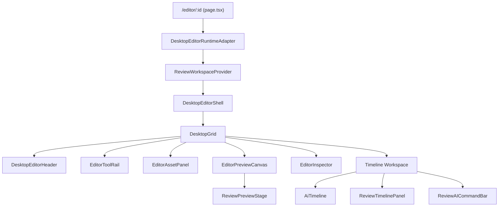
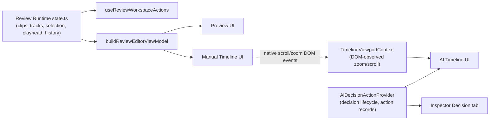
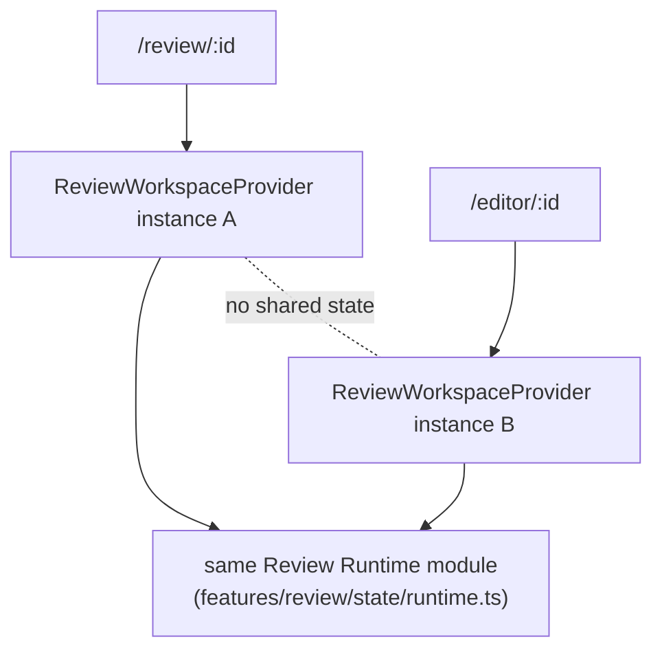
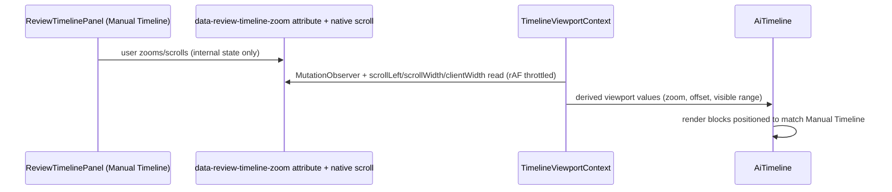
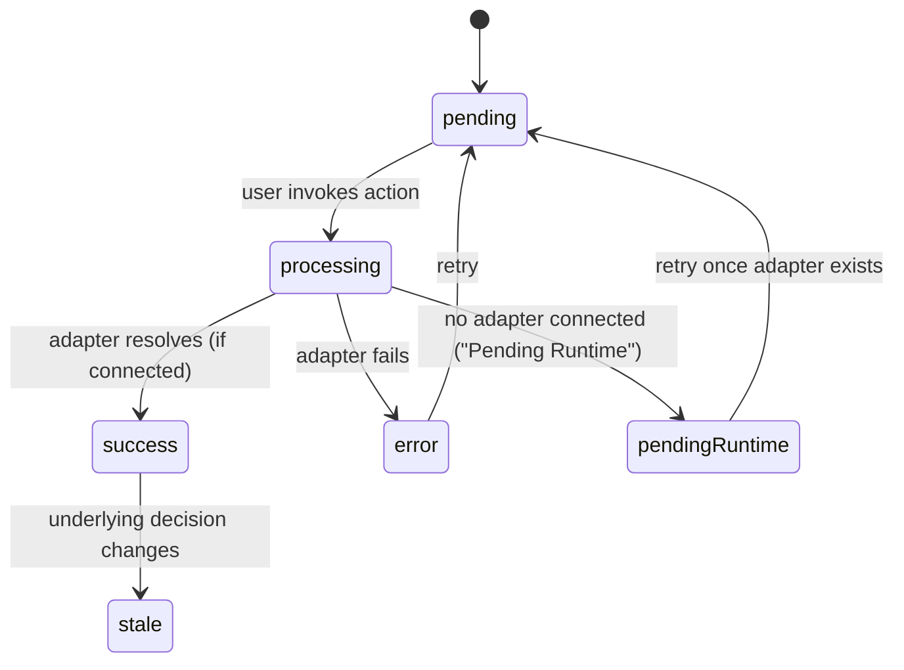
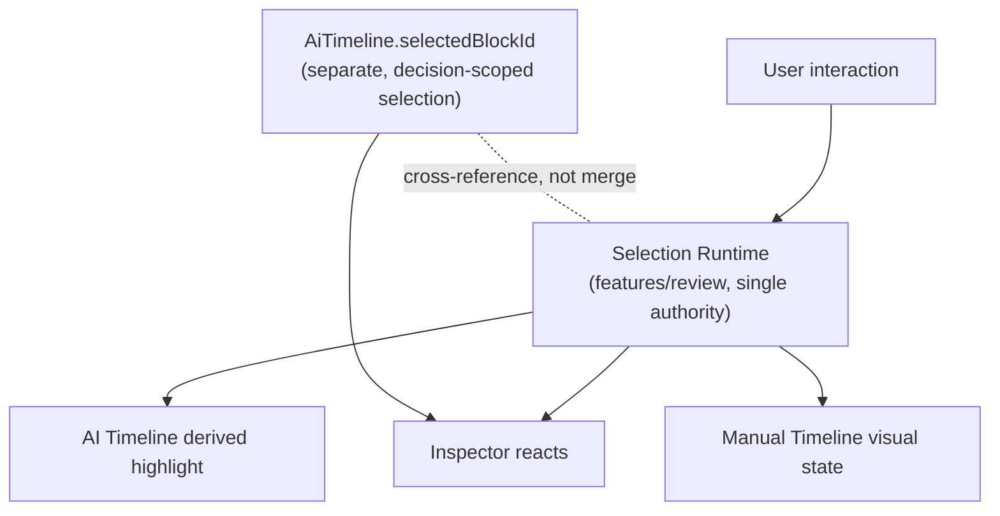
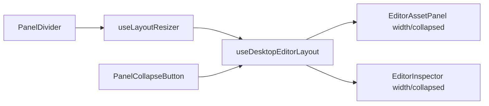
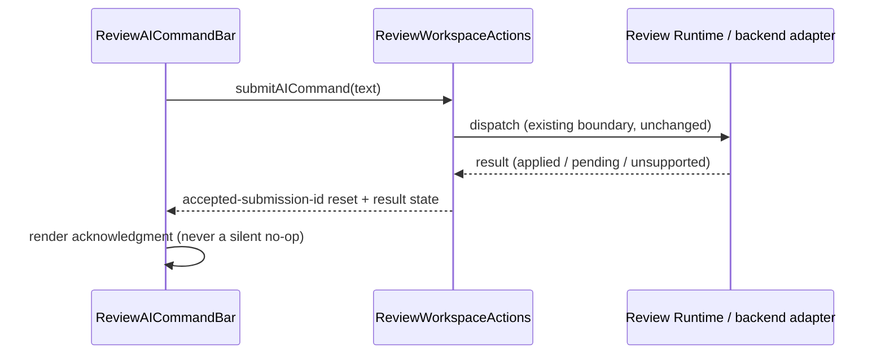

# Desktop Editor UX Blueprint

Sprint 17.1.5 — Desktop UX Blueprint
Date: 2026-07-25
Status: Blueprint — implementation contract for Sprints 17.2–17.8. No code changed by this document.

This document defines the target information hierarchy, canonical layout, wireframes, architecture diagrams, panel/docking rules, responsive behavior, and phase boundaries for the Desktop Editor. It documents the REAL current architecture (`features/desktop-editor`, `features/review`, `features/ai-timeline`, `features/ai-decision-actions`) plus the intended presentation direction — it does not invent new runtime mechanisms.

---

## 1. Information hierarchy

Ranked by workspace priority (see `editor-ui-principles.md` P1–P5):

1. **Manual Timeline** (`ReviewTimelinePanel`) — the authoritative edit surface. Highest floor-protection.
2. **Preview** (`ReviewPreviewStage` inside `EditorPreviewCanvas`) — the authoritative visual-judgment surface. Highest floor-protection.
3. **AI Timeline** (`AiTimeline`) — review layer bonded to Manual Timeline's time axis; smaller footprint by default, never dominant.
4. **Inspector** (`EditorInspector` — Properties / AI Copilot / Decision) — contextual, reacts to selection.
5. **Asset Panel** (`EditorAssetPanel`) — contextual source browser; collapsible.
6. **Tool Rail** (`EditorToolRail`) — fixed-width navigation between modes/tools; always visible, narrow.
7. **AI Director / Command Bar** (`ReviewAICommandBar`) — embedded command surface, docked near Preview/Timeline, not a separate page.
8. **Header** (`DesktopEditorHeader`) — project identity, global actions (Export, Save state), thinnest visual weight.

This ordering governs every resize/collapse/priority decision throughout this blueprint.

---

## 2. Canonical layout

Single-window, single-workspace desktop layout — no route change between "browsing" and "editing" (already true: `/editor/:id`). Vertical split: Header (top, fixed height) → Body (fills remaining height) → Body splits into Upper Zone (Tool Rail + Asset Panel + Preview + Inspector) and Lower Zone (Timeline Workspace: Manual Timeline + AI Timeline + timeline toolbar).

```
┌─────────────────────────────────────────────────────────────────┐
│ Header (project title, save state, Export)                      │
├───────┬───────────────┬───────────────────────────┬─────────────┤
│ Tool  │ Asset Panel   │ Preview                    │ Inspector   │
│ Rail  │ (collapsible) │ (protected minimum)        │ (resizable) │
│       │               │                            │             │
├───────┴───────────────┴───────────────────────────┴─────────────┤
│ Timeline Workspace                                               │
│  ┌─ AI Timeline (review layer, smaller default height) ───────┐ │
│  ├─ Manual Timeline (authoritative edit surface) ─────────────┤ │
│  └─ AI Director / Command Bar (docked strip) ─────────────────┘ │
└───────────────────────────────────────────────────────────────────┘
```

This is the same structural shape already implemented by `DesktopEditorShell`/`DesktopGrid` — this blueprint does not restructure the grid, it documents the priorities and rules governing it for Sprints 17.2+.

---

## 3. Named wireframes (ASCII)

### W1 — Full desktop, all panels expanded (1920×1080 baseline)

```
┌────────────────────────────────────────────────────────────────────────────┐
│ [Logo] Project: Summer Campaign v3      Saved ✓        [Share] [Export ▾]  │
├────┬────────────┬──────────────────────────────────────┬──────────────────┤
│ ▣  │ ASSETS     │                                      │ INSPECTOR        │
│ ▢  │ ┌────────┐ │                                      │ [Properties][AI] │
│ ▢  │ │clip1.mp4│ │        PREVIEW CANVAS                │ [Decision]       │
│ ▢  │ ├────────┤ │        (16:9, centered, dark canvas) │                  │
│ AI │ │clip2.mp4│ │                                      │ Clip: Intro.mp4  │
│ ▢  │ ├────────┤ │        ▶ 00:12 / 02:45                │ Duration: 4.2s   │
│    │ │clip3.mp4│ │        [◀◀][▶][▶▶] 🔊 ── ⛶           │ Speed: 1.0x      │
│    │ └────────┘ │                                      │ [Trim] [Split]   │
├────┴────────────┴──────────────────────────────────────┴──────────────────┤
│ AI TIMELINE  ░░▓▓▓░░░▓▓▓▓░░░▓▓░░░░▓▓▓▓▓░░░  (decision blocks, compact)     │
│ ──────────────────────────────────────────────────────────────────────── │
│ MANUAL TIMELINE                                              🔍 ─●───     │
│  V1 │[ Intro.mp4 ][ B-roll.mp4      ][ Outro.mp4 ]                        │
│  A1 │[ VO track                                    ]                     │
│  S1 │      [Caption 1]  [Caption 2]        [Caption 3]                    │
├──────────────────────────────────────────────────────────────────────────┤
│ ✦ Ask AI Director: "Tighten the intro by 2 seconds"              [Send]  │
└──────────────────────────────────────────────────────────────────────────┘
```

### W2 — Asset Panel collapsed

```
┌────────────────────────────────────────────────────────────────────────────┐
│ [Logo] Project: Summer Campaign v3      Saved ✓        [Share] [Export ▾]  │
├────┬──┬──────────────────────────────────────────────────┬────────────────┤
│ ▣  │▸ │                                                    │ INSPECTOR      │
│ ▢  │  │              PREVIEW CANVAS (wider)                │                │
│ ▢  │  │                                                    │                │
│ AI │  │              ▶ 00:12 / 02:45                       │                │
├────┴──┴──────────────────────────────────────────────────┴────────────────┤
│ AI TIMELINE  ░░▓▓▓░░░▓▓▓▓░░░▓▓░░░░▓▓▓▓▓░░░                                 │
│ MANUAL TIMELINE  V1 │[ ... ][ ... ][ ... ]   A1 │[ ... ]   S1 │[..][..]    │
├──────────────────────────────────────────────────────────────────────────┤
│ ✦ Ask AI Director...                                              [Send]  │
└──────────────────────────────────────────────────────────────────────────┘
```

### W3 — Inspector collapsed

```
┌────────────────────────────────────────────────────────────────────────┬──┐
│ [Logo] Project: Summer Campaign v3      Saved ✓        [Share] [Export▾]│  │
├────┬────────────┬───────────────────────────────────────────────────┬──┴──┤
│ ▣  │ ASSETS     │                                                    │▸    │
│ ▢  │ [ clips ]  │              PREVIEW CANVAS (wider)                │     │
│ AI │            │              ▶ 00:12 / 02:45                       │     │
├────┴────────────┴───────────────────────────────────────────────────┴─────┤
│ AI TIMELINE / MANUAL TIMELINE (unchanged)                                  │
└──────────────────────────────────────────────────────────────────────────┘
```

### W4 — Both side panels collapsed (Preview/Timeline maximized)

```
┌────────────────────────────────────────────────────────────────────────┐
│ [Logo] Project: Summer Campaign v3      Saved ✓        [Share][Export▾]│
├────┬──┬──────────────────────────────────────────────────────────┬────┤
│ ▣  │▸ │                  PREVIEW CANVAS (max width)               │▸  │
│ ▢  │  │                  ▶ 00:12 / 02:45                          │   │
├────┴──┴──────────────────────────────────────────────────────────┴────┤
│ AI TIMELINE / MANUAL TIMELINE (full width)                             │
└──────────────────────────────────────────────────────────────────────┘
```

### W5 — AI Timeline collapsed (Manual Timeline only)

```
├──────────────────────────────────────────────────────────────────────────┤
│ ▸ AI Timeline (collapsed — click to expand)                               │
│ MANUAL TIMELINE                                              🔍 ─●───     │
│  V1 │[ Intro.mp4 ][ B-roll.mp4      ][ Outro.mp4 ]                        │
│  A1 │[ VO track                                    ]                     │
│  S1 │      [Caption 1]  [Caption 2]        [Caption 3]                    │
├──────────────────────────────────────────────────────────────────────────┤
```

### W6 — Selection state: clip selected on Manual Timeline

```
│  V1 │[ Intro.mp4 ][▓B-roll.mp4▓ SELECTED  ][ Outro.mp4 ]                  │
│                          ↑ Inspector "Properties" tab now shows this clip │
│                          ↑ AI Timeline dims/highlights related decision   │
```

### W7 — AI Decision block states (compact AI Timeline row)

```
│ AI TIMELINE  [pending░][accepted▓][processing◐][stale▒][error✕][disabled◌]│
```

### W8 — Empty project (no assets, no AI decisions yet)

```
├────┬────────────┬──────────────────────────────────────┬──────────────────┤
│ ▣  │ ASSETS     │                                      │ INSPECTOR        │
│ ▢  │ (empty)    │        Drop source video here         │ No selection     │
│ AI │ "No assets  │        or                             │                  │
│    │  yet —      │        [ Import Media ]               │                  │
│    │  import to  │                                       │                  │
│    │  start"     │                                       │                  │
├────┴────────────┴──────────────────────────────────────┴──────────────────┤
│ AI TIMELINE — "AI will generate a rough cut once source media is added"    │
│ MANUAL TIMELINE — (empty tracks, ready to receive clips)                   │
```

### W9 — AI command submitted, pending runtime response

```
├──────────────────────────────────────────────────────────────────────────┤
│ ✦ "Tighten the intro by 2 seconds"                    ⏳ Pending Runtime  │
└──────────────────────────────────────────────────────────────────────────┘
```

### W10 — Small laptop viewport (1366×768), condensed

```
┌──────────────────────────────────────────────────────────────────┐
│ [Logo] Summer Campaign v3        Saved ✓          [Export ▾]      │
├──┬───┬──────────────────────────────────────────────────────┬────┤
│▣ │▸  │           PREVIEW (min protected width)                │▸  │
│▢ │   │           ▶ 00:12 / 02:45                              │   │
├──┴───┴──────────────────────────────────────────────────────┴────┤
│ AI TIMELINE (compact, icon-only blocks)                            │
│ MANUAL TIMELINE  🔍 ─●───                                          │
│  V1│[..][..][..]  A1│[....]  S1│[.][.]                             │
├────────────────────────────────────────────────────────────────────┤
│ ✦ Ask AI...                                                 [Send] │
└──────────────────────────────────────────────────────────────────┘
```

---

## 4. Named diagrams (Mermaid)

### D1 — Editor shell composition (real component hierarchy)



### D2 — State ownership (who owns what)



### D3 — Two independent editor instances (Review vs Editor route)



### D4 — AI Timeline / Manual Timeline synchronization (DOM-observation bridge, not shared React state)



### D5 — AI Decision action lifecycle (honesty pattern)



### D6 — Selection propagation (single authority, multiple observers)



### D7 — Panel resize/collapse system



### D8 — Natural-language command path (AI Director)



---

## 5. Panel and docking rules

| Panel | Default width/height | Min | Max | Collapsible | Resizable | Docking |
|---|---|---|---|---|---|---|
| Tool Rail | `--ce-dim-tool-rail-width` | fixed | fixed | No | No | Always left-most, fixed |
| Asset Panel | `--ce-dim-asset-panel-default` | `--ce-dim-asset-panel-min` | `--ce-dim-asset-panel-max` (320px) | Yes | Yes | Left, between Tool Rail and Preview |
| Preview | fills remaining width | protected floor (see P3) | — | No | No (derived from siblings) | Center |
| Inspector | `--ce-dim-inspector-default` | `--ce-dim-inspector-min` | `--ce-dim-inspector-max` (340px) | Yes | Yes | Right-most |
| AI Timeline | `--ce-dim-ai-timeline-height-default` (110–150px) | collapsed (0, header only) | ~200px | Yes | Yes (bounded) | Top of Timeline Workspace |
| Manual Timeline | fills remaining Timeline Workspace height | protected floor | — | No | No (derived) | Below AI Timeline |
| AI Director | fixed height docked strip | fixed | fixed | No (always present) | No | Bottom of Timeline Workspace |

Rules:
- Collapse priority order on space pressure: Asset Panel narrows → Inspector narrows → Asset Panel collapses → Inspector collapses → AI Timeline collapses. Preview and Manual Timeline are never candidates.
- No panel may float, overlay Preview/Timeline, or become a separate window in this program's scope (17.2–17.8). Any docking mode beyond the fixed grid above is a Future Runtime Requirement.
- Panel state (width, collapsed) is session-local (P30) — no persistence added without an explicit future decision.

---

## 6. Responsive blueprint (4 resolutions)

| Viewport | Tool Rail | Asset Panel | Preview | Inspector | Timeline behavior |
|---|---|---|---|---|---|
| 1920×1080 (baseline) | full | default width, expanded | full protected size | default width, expanded | AI Timeline + Manual Timeline both fully expanded |
| 1440×900 | full | default width | protected floor maintained | default width | unchanged; slightly less headroom, math re-verified per `frontend-responsive-system.md` |
| 1366×768 (minimum supported) | full | narrowed toward min | protected floor exactly met | narrowed toward min | AI Timeline blocks compact toward icon-only (P21); Manual Timeline unaffected |
| <1366 width (below minimum) | full | auto-collapsed | protected floor maintained by forcing Asset Panel + Inspector both collapsed | auto-collapsed | Out of supported range; app still usable via W4-style collapsed layout, not a hard cutoff |

Underlying math (verified in `frontend-responsive-system.md`, reaffirmed here, not recomputed): Tool Rail + Asset Panel(max 320px) + Inspector(max 340px) + 2 dividers, subtracted from 1366px, still leaves Preview at or above its documented minimum width — this is the guarantee behind P3.

---

## 7. Future Runtime Requirements

Interactions/desires that this blueprint acknowledges as desirable but that have **no supporting runtime today** — explicitly NOT scheduled into Sprint 17.2 by this document:

- **FRR-1**: Consolidated Inspector data model unifying Properties/AI Copilot/Decision into one state source (currently three separate sources; P24 keeps them separate through 17.8).
- **FRR-2**: Persisted panel layout (width/collapse) across reloads/sessions (currently session-local only; P30).
- **FRR-3**: Floating/undockable panels or multi-window support (currently a fixed single-grid layout only).
- **FRR-4**: Direct click-to-select inside the Preview canvas driving a second selection surface (currently Preview has no selection-owning interaction; P11 forbids adding one without going through Selection Runtime).
- **FRR-5**: AI Copilot / AI Director actions with a connected backend adapter for most suggestion types (currently mostly unconnected; "Pending Runtime" is the correct, honest current state per P36).
- **FRR-6**: A minimap/overview scrollbar for very long timelines (no such mechanism exists in Timeline Runtime today; would require Timeline Runtime's own opt-in, not a UI-only addition per P15).
- **FRR-7**: Cross-highlighting from an AI Timeline decision directly to affected Manual Timeline clip ranges beyond the current shared-time-axis relationship (would require a new, explicit data linkage not present in `AiBlock`/clip models today).

---

## 8. Sprint 17.2–17.8 implementation boundaries

Per `frontend-redesign-master-plan.md`, restated here as this blueprint's direct handoff:

Sprint numbering matches `frontend-redesign-master-plan.md` exactly:

- **17.2 — Desktop Editor Shell Redesign**: apply `--ce-*` tokens directly to `features/desktop-editor`/`features/ai-timeline` component classes (bypassing the 17.1 alias layer where values differ); apply surface-contrast-before-borders to shell chrome. No runtime changes. No new panels.
- **17.3 — Preview & Playback Workspace**: chrome-only visual pass (idle-dim, canvas background, control cluster) per P10. No new selection mechanism (FRR-4 stays deferred).
- **17.4 — Asset Library Experience**: visual/token pass on `editor-asset-panel.tsx`, real empty/loading/error states via consolidated primitives, collapse/resize behavior verification against `PanelDivider`/`useLayoutResizer` (already implemented, no new mechanism).
- **17.5 — Manual Timeline Visual System**: selected/hover/locked/disabled visual treatment (P14) on the wrapping `EditorTimelineWorkspace` chrome only — explicitly excludes anything inside `features/review/shell/timeline.tsx`; toolbar grouping per UX audit F9 remains blocked pending a separate runtime-boundary exception.
- **17.6 — AI Timeline Experience**: compact/icon-only legibility (P21), lifecycle-state visual treatment (P18) via `--ce-decision-*` tokens, height-default enforcement (P16).
- **17.7 — Contextual Inspector**: unify presentation rhythm across Properties/AI Copilot/Decision tabs (P22) while keeping three data sources separate (P24, FRR-1 deferred).
- **17.8 — AI Director & Copilot**: visual pass on `ReviewAICommandBar` context indicator (P25) and acknowledgment states (P26); no new submission path (P27).

No sprint in this range may: touch Timeline/Playback/History/Selection/Drag/Trim/Keyboard/Clipboard runtime logic, add backend calls, invent persistence, or resolve any Future Runtime Requirement above.
